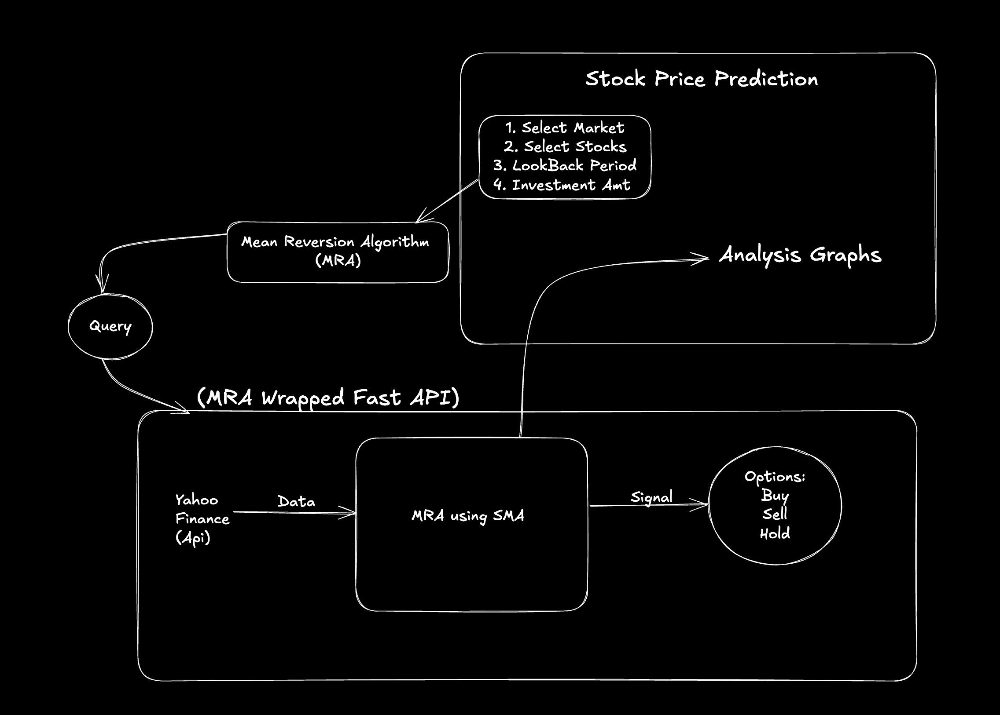

# Mean Reversion Strategy Analyzer

A web application that analyzes stocks using a mean reversion strategy optimized for day trading. The application provides buy/sell signals based on price deviations from moving averages, using an API to be integrated with other Applications

## System Design 



## Features

- Real-time stock analysis using mean reversion strategy
- Support for multiple markets (NSE, BSE, US)
- Interactive charts and visualizations
- Detailed trading signals and recommendations
- Risk management indicators (Stop Loss, Take Profit)

## API Endpoint checking

For Mac Users:
```
cd Trading_API
python3 -m .venv venv
source .venv/bin/activate
pip install -r requirements.txt
python main.py
```

## Supported Markets:
KL - malaysian_market
NS - Indian National Stock Exchange
US - US Stock Exchange
BO - Bombay Stock Exchange

For further details test our API to learn more

## Setup and Installation

0. Clone the repository:
   ```bash
   git clone https://github.com/1Ayush-Petwal/upValue_project.git
   cd upValue_project
   ```

2. Run the Analystics Platform:
   ```bash
   cd Trading_Algo
   python -m venv .venv
   source .venv/bin/activate  # On Windows: venv\Scripts\activate
   pip install -r requirements.txt
   streamlit run app.py
   ```

3. API over the Trading Engine
   ```bash
   # from root directory
   cd Trading_API
   python -m venv .venv
   source .venv/bin/activate
   pip install -r requirements.txt
   python main.py
   ```

## Testing API

1. Use the get_markets endpoint for getting the markets
2. Use the default_stocks_market to get the stock options for each of the market
3. Use them to test the main_functions
```
get_mean_reversion_signals():
analyse():
```

## Deployment


Further steps include the deployment of the API using Render & Vercel based frontend